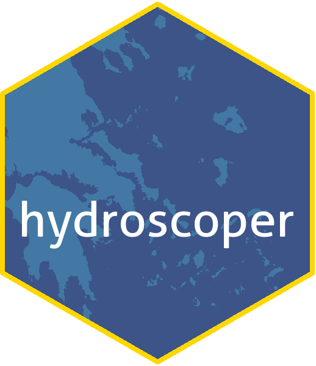

<!-- README.md is generated from README.Rmd. Please edit that file -->

```{r, echo = FALSE}
knitr::opts_chunk$set(
  collapse = TRUE,
  comment = "#>",
  fig.path = "man/figures/README-"
)
```

[](https://travis-ci.org/kvantas/hydroscoper)
[](https://ci.appveyor.com/project/kvantas/hydroscoper)
[](https://codecov.io/gh/kvantas/hydroscoper) 
[](https://cran.r-project.org/)
[](https://cran.r-project.org/package=hydroscoper)
[](commits/master)
[](https://zenodo.org/badge/latestdoi/114094911)

 

`hydroscoper` is an R interface to the  Greek National Data Bank for Hydrological and Meteorological Information, [Hydroscope](http://www.hydroscope.gr/). Hydroscope is the result of long-standing efforts by numerous Greek scientists in collaboration with various companies and associations. It was implemented in three phases, funded by the Ministry of Development, the Ministry of Environment and Energy and the European Union.

Hydroscope, provides several national data sources from various organisations via a web interface. Each participating organisation keeps its data on its own server using the Enhydris database system for the storage and management of hydrological and meteorological data. These organisations are:

* Ministry of Environment and Energy.
* Ministry of Rural Development and Food.
* National Meteorological Service.
* National Observatory of Athens.
* Greek Prefectures.
* Public Power Corporation.

The data are structured as tables and space separated text files, but are in Greek, thus limiting their usefulness.

`hydroscoper` covers Hydroscope's data sources using the [Enhydris API](http://enhydris.readthedocs.io/en/latest/index.html) and provides functions to:

1. Transform the available tables and data sets into tidy data frames.
2. Transliterate the Greek Unicode names to Latin.
3. Translate various Greek terms to English.

## Data sources

 * Ministry of Environment and Energy, National Observatory of Athens and Greek Prefectures, http://kyy.hydroscope.gr/
 * Ministry of Rural Development and Food, http://ypaat.hydroscope.gr
 * National Meteorological Service, http://emy.hydroscope.gr
 * Greek Public Power Corporation, http://deh.hydroscope.gr

Note that only the two Ministries allow to download time series values freely.
 
## Installation

Install the stable release from CRAN with:

```{r cran_installation, eval = FALSE}
install.packages("hydroscoper")
```

You can install the development version from GitHub with:

```{r gh-installation, eval = FALSE}
# install.packages("devtools")
devtools::install_github("kvantas/hydroscoper")
```


## Using hydroscoper

The available functions that are provided by `hydroscoper` are:

* `get_stations` to retrieve a tidy data frame with stations' data for a given data source.
* `get_timeseries` to retrieve a tidy data frame with a time series' data for a given data source. 
* `get_data` to retrieve a tidy data frame with a time series' values.

## Example

This is a basic example which shows you how to get a data frame with stations from the Ministry of Environment and Energy:

```{r get_stations}
library(hydroscoper)
stations <- get_stations(subdomain = "kyy")
head(stations[c("station_id", "name", "water_division", "long", "lat", "altitude")], 10)
```

To get the time series for station **200251** run:

```{r get_time_series}

ts_data <- get_timeseries(subdomain = "kyy")
ts <- subset(ts_data, station_id == 200251)
ts[c("timeseries_id", "variable", "unit_of_measurement", "time_step")]
```

You can get the time series **912** to a tidy data frame with:
```{r get_data}
df <- get_data(subdomain = "kyy", time_id = 912)
```

Let's create a plot for these data:
```{r plot_timeseries}
library(ggplot2)
ggplot(data = df, aes(x = Date, y = Value))+
  geom_line()+
  labs(title="Dailly rainfall data for station 200251",
       x="Date", y = "Rain (mm)")+
  theme_classic()

```

## Meta

* Please [report any issues or bugs](https://github.com/kvantas/hydroscoper/issues).
* Licence:
    + All code is licenced MIT.
    + All data are from the public data sources in http://www.hydroscope.gr/.
* To cite `hydroscoper`, please use:
  ```
  Konstantinos Vantas (2017). hydroscoper: Interface to Hydroscope. R package version 0.1.0.
  https://github.com/kvantas/hydroscoper
  ```
  A BibTeX entry for LaTeX users is
  ```
   @Manual{,
    title = {hydroscoper: Interface to Hydroscope},
    author = {Konstantinos Vantas},
    year = {2017},
    note = {R package version 0.1.0},
    url = {https://github.com/kvantas/hydroscoper},
  }
  ```
* Please note that this project is released with a [Contributor Code of Conduct](/CONDUCT.md). By participating in this project you agree to abide by its terms.

## References
[Hydroscope](http://www.hydroscope.gr/)
