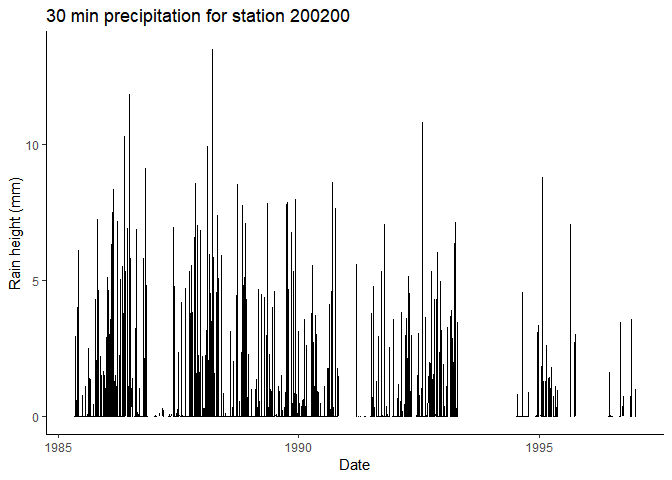

hydroscoper
================

<!-- README.md is generated from README.Rmd. Please edit that file -->

[](https://travis-ci.org/kvantas/hydroscoper)
[](https://ci.appveyor.com/project/kvantas/hydroscoper)
[](https://codecov.io/gh/kvantas/hydroscoper)
[](https://cran.r-project.org/)
[](https://cran.r-project.org/package=hydroscoper)
[](commits/master)
[](http://www.rdocumentation.org/packages/hydroscoper)
[](http://cran.rstudio.com/web/packages/hydroscoper/index.html)
[](https://zenodo.org/badge/latestdoi/114094911)


`hydroscoper` is an R interface to the Greek National Data Bank for
Hydrological and Meteorological Information,
[Hydroscope](http://www.hydroscope.gr/). Hydroscope is the result of
long-standing efforts by numerous Greek scientists in collaboration with
various companies and associations. It was implemented in three phases,
funded by the Ministry of Development, the Ministry of Environment and
Energy and the European Union.

Hydroscope, provides several national data sources from various
organisations via a web interface. Each participating organisation keeps
its data on its own server using the Enhydris database system for the
storage and management of hydrological and meteorological data. These
organisations are:

  - Ministry of Environment and Energy
  - Ministry of Rural Development and Food
  - National Meteorological Service
  - National Observatory of Athens
  - Greek Prefectures
  - Public Power Corporation

The data are structured as tables and space separated text files, but
are in Greek, thus limiting their usefulness.

`hydroscoper` covers Hydroscope’s data sources using the [Enhydris
API](http://enhydris.readthedocs.io/en/latest/index.html) and provides
functions to:

1.  Transform the available tables and data sets into tidy data frames
2.  Transliterate the Greek Unicode names to Latin
3.  Translate various Greek terms to English

## Data sources

  - Ministry of Environment and Energy, National Observatory of Athens
    and Greek Prefectures, <http://kyy.hydroscope.gr/>
  - Ministry of Rural Development and Food, <http://ypaat.hydroscope.gr>
  - National Meteorological Service, <http://emy.hydroscope.gr>
  - Greek Public Power Corporation, <http://deh.hydroscope.gr>

Note that only the two Ministries allow to download time series values
freely.

## Installation

Install the stable release from CRAN with:

``` r
install.packages("hydroscoper")
```

You can install the development version from GitHub with:

``` r
# install.packages("devtools")
devtools::install_github("kvantas/hydroscoper")
```

## Using hydroscoper

The functions that are provided by `hydroscoper` are:

  - `get_stations, get_timeseries, get_instruments, get_water_basins,
    get_water_divisions, get_political_divisions, get_variables,
    get_units_of_measurement, get_time_steps, get_owners,
    get_instruments_type, get_station_type, get_database` family
    functions, to retrieve a data frame with Hydroscope’s data for a
    given data source
  - `get_data`, to retrieve a tidy data frame with values of a time
    series
  - `get_coords`, to convert Hydroscope’s points raw format to a tidy
    data frame
  - `hydro_translate` to translate various terms and names from Greek to
    English

The data sets that are provided by `hydroscoper` are:

  - `stations` a tidy data frame with stations’ data from Hydroscope
  - `timeseries` a tidy data frame with time series’ data from
    Hydroscope

## Example

This is a basic example which shows you how to get the stations’ and
time series data from the Hydroscope’s Ministry of Environment and
Energy database, <http://kyy.hydroscope.gr/>.

We will use the the package’s data `stations` and `timeseries`, to
reduce the time needed with data munging. We can subset the station’s
data for the `kyy` sub-domain with:

``` r
library(hydroscoper)
library(tibble)
data("stations")
kyy_stations <- subset(stations, subdomain == "kyy")
as_tibble(kyy_stations)
#> # A tibble: 425 x 9
#>    station_id name       water_ba~ water_~ owner   long~ lati~ alti~ subd~
#>  *      <int> <chr>      <chr>     <chr>   <chr>   <dbl> <dbl> <dbl> <chr>
#>  1     501032 AG. BASIL~ "KOURTAL~ GR13    min_ag~  NA    NA      NA kyy  
#>  2     200246 GEPH. KOK~ "ALPHEIO~ GR01    min_en~  22.0  37.5   318 kyy  
#>  3     200237 TROPAIA    "ALPHEIO~ GR01    min_en~  22.0  37.7   728 kyy  
#>  4     200231 BYTINA     "ALPHEIO~ GR01    min_en~  22.2  37.7  1011 kyy  
#>  5     200200 LYKOURIA   "ALPHEIO~ GR01    min_en~  22.2  37.9   758 kyy  
#>  6     200236 MEGALOPOLE "ALPHEIO~ GR01    min_en~  22.1  37.4   429 kyy  
#>  7     200244 ODOG. AG.~ "REMA CH~ GR01    min_en~  21.8  37.0   182 kyy  
#>  8     200204 TRIPOTAMA  "ALPHEIO~ GR01    min_en~  21.9  37.9   570 kyy  
#>  9     200198 KASTELLIO  "ALPHEIO~ GR01    min_en~  22.0  37.9   792 kyy  
#> 10     200239 PERDIKONE~ "ALPHEIO~ GR01    min_en~  22.0  37.7   837 kyy  
#> # ... with 415 more rows
```

To get the time series’ data for the station `200200`
(<http://kyy.hydroscope.gr/stations/d/200200/>) we can use:

``` r
station_ts <- subset(timeseries, station_id == 200200)
as_tibble(station_ts)
#> # A tibble: 4 x 8
#>   timeser_id station_id variable      timestep   units start~ end_d~ subd~
#> *      <int>      <int> <chr>         <chr>      <chr> <chr>  <chr>  <chr>
#> 1        761     200200 wind_direc    <NA>       °     1948-~ 1997-~ kyy  
#> 2         56     200200 precipitation 30_minutes mm    1985-~ 1997-~ kyy  
#> 3        760     200200 snow          daily      mm    1948-~ 1997-~ kyy  
#> 4        759     200200 precipitation daily      mm    1953-~ 2011-~ kyy
```

You can get the station’s time series **56**
(<http://kyy.hydroscope.gr/time> series/d/56/):

``` r
ts_raw <- get_data(subdomain = "kyy",time_id = 56)
ts_raw
#> # A tibble: 147,519 x 3
#>    Date                Value Comment
#>    <dttm>              <dbl> <chr>  
#>  1 1985-05-06 08:00:00     0 1      
#>  2 1985-05-06 08:30:00     0 1      
#>  3 1985-05-06 09:00:00     0 1      
#>  4 1985-05-06 09:30:00     0 1      
#>  5 1985-05-06 10:00:00     0 1      
#>  6 1985-05-06 10:30:00     0 1      
#>  7 1985-05-06 11:00:00     0 1      
#>  8 1985-05-06 11:30:00     0 1      
#>  9 1985-05-06 12:00:00     0 1      
#> 10 1985-05-06 12:30:00     0 1      
#> # ... with 147,509 more rows
```

Let’s create a plot:

``` r
library(ggplot2)
ggplot(data = ts_raw, aes(x = Date, y = Value))+
  geom_line()+
  labs(title= "30 min precipitation for station 200200",
       x="Date", y = "Rain height (mm)")+
  theme_classic()
```

<!-- -->

## Meta

  - Please [report any issues or
    bugs](https://github.com/kvantas/hydroscoper/issues).

  - Licence:
    
      - All code is licensed MIT.
      - All data are from the public data sources in
        <http://www.hydroscope.gr/>.

  - To cite `hydroscoper`, please
        use:
    
        Konstantinos Vantas (2017). hydroscoper: Interface to Hydroscope, R package version 0.1.0, URL http://CRAN.R-project.org/package=hydroscoper
    
    A BibTeX entry for LaTeX users is
    
    ``` 
     @Manual{,
      title = {hydroscoper: Interface to Hydroscope},
      author = {Konstantinos Vantas},
      year = {2017},
      note = {R package version 0.1.0},
      url = {http://CRAN.R-project.org/package=hydroscoper},
    }
    ```

  - Please note that this project is released with a [Contributor Code
    of Conduct](/CONDUCT.md). By participating in this project you agree
    to abide by its terms.

## References

[Hydroscope](http://www.hydroscope.gr/)
